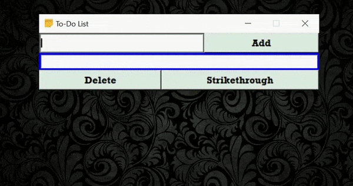

[](https://www.python.org/downloads/release/python-3102/)


<p align = "center">
<a href="https://github.com/FranGarcia94/ToDo-list-Listbox"></a>
</p>
<p align = "center">
<b>ToDo List with Listbox</b>
</p>


# Introduction


If we take a look at my repository we can see a graphical interface that emulates a calendar/agenda where you can write down events, appointments, meetings or things to do on specific days.

However, it didn't work as a general ToDo-List which is exactly what we have here.

A simple ToDo-List whose interface adapts to the amount of events that positions in it, minimalist but practical. The interface consists of a text input box, 3 buttons and the central part where we will see the events.

This is how it works.

# Add

Write the event to be saved and press `Add`. This will automatically add the event to the center box, but will also write it to a text file with extension `.txt` named `task_list.txt`.

If it doesn't already exist it will be created automatically and if it already exists, it will simply add the new event.

This is where the events will be saved when the application is closed. To select the folder where this file will be stored we must change the following lines of code:

```python

    def load_task():
        
        # Create the .txt file if it doesn't exist
        with open('task_list.txt', 'a+') as f:

            f.close()

        with open('task_list.txt', 'r', encoding = "utf-8") as f:

            txt_reader = f.readlines()

```

```python

    def close_gui():
        
        with open('task_list.txt', 'w', encoding = "utf-8") as f:

            for i in lb.get(0, END):

                f.write(i + '\n')

    
    root.destroy()

```

You only have to add a path or simply write the name you want, this will create the file in the user's root folder.


# Delete[^1]

Little to add here, it deletes the event and also as we have already seen, when adding an element the interface expands. In this case it becomes smaller to adapt to the number of events that exist.

The event is also deleted from the text file.

# Strikethrough[^1]

This function is not only used to strikethrough an element but also to undo it.


[^1]: As we can see in the GIF at the beginning, in the `Delete` and `Strikethrough` functions one or several elements can be selected. In the case of `Strikethrough` you can select strikethrough or non-strikethrough elements and when pressing the button they will change to the corresponding state.
